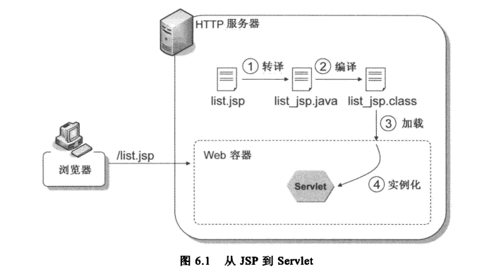

# JSP 介绍

Servlet 有两个缺陷无法克服。第一，在 Servlet 中编写的所有 HTML 标签都必须包在 Java 字符串中；第二，所有文本和 HTML 标签都必须进行硬编码，一旦有修改必须重新编译。JavaServer Pages（JSP）解决了 Servlet 的这两个问题。

JSP 实际上就是 Servlet，它最终会由容器转译为 Servlet 类、编译为 .class 文件、加载并实例化为 Servlet 对象。所以，基本上 Servlet 能实现的功能，JSP 也能做到。

实际上，每个 JSP 中的元素，都可以对照至 Servlet 中的某个元素或代码，如隐式对象、指令、脚本元素等都与 Servlet 有实际的对应。



JSP 页面是在 JSP 容器中运行的。Servlet 容器一般也是 JSP 容器。

JSP 转译为的 Servlet 必须实现 `javax.servlet.jsp.JspPage` 接口或其子接口 `javax.servlet.jsp.HttpJspPage`。所生成的 Servlet 的类名取决于 Servlet/JSP 容器。

在第一次请求 JSP 时，容器会进行转译、编译与加载的操作，所以第一次请求 JSP 会较慢。对于同一个
JSP 的后续请求，Servlet/JSP 容器会查看这个 JSP 自从最后一次转译以来是否修改过。如果修改过，就会重新转译、编译并执行；如果没有，则执行内存中已经存在的 JSP Servlet。

## JSP 的生命周期

以 Tomcat 或 Glassfish 为例，JSP 转译后的 Servlet 继承自 `org.apache.jasper.runtime.HttpJspBase`。`HttpJspBase` 实现了 `javax.servlet.jsp.HttpJspPage` 接口（JSP 规范所要求的），同时继承自 `HttpServlet`，并实现了 Servlet 的生命周期方法：

* `init()` 调用了 `jspInit()` 和 `_jspInit()`，其中 `_jspInit()` 由转译后的 Servlet 重新定义。如果想自定义 JSP 初始化时的动作，可以覆盖 `jspInit()`，即使用 JSP 声明定义一个 `jspInit()`。
* `service()` 调用了 `_jspService()`。在 JSP Scriptlet 中定义的 Java 代码会出现在转译后的 Servlet 的  `_jspService()` 中。
* `destroy()` 调用了 `jspDestroy()` 和 `_jspDestroy()`，其中 `_jspDestroy()` 由转译后的 Servlet 重新定义。如果想自定义 JSP 销毁时的动作，可以覆盖 `jspDestroy()`，即使用 JSP 声明定义一个 `jspDestroy()`。

注意：带下划线的 `_jspInit()`、`_jspService()` 和 `_jspDestroy()` 由容器在转译时维护，开发人员不应该覆盖这些方法。如果想要自定义 JSP 初始化或销毁时的动作，应该覆盖 `jspInit()` 和 `jspDestroy()` 方法。

* _jspInit() 初始化 JSP，对应
* _jspService() 服务请求
* _jspDestroy() 销毁 JSP

## JSP 隐式对象

另外，在 JSP 转译后的 Servlet 的 `_jspService()` 中，还自动生成了一系列局部变量（例如 request、response、out 等等），可以在 JSP Scriptlet 和表达式中直接使用这些对象。这些对象称为隐式对象（implicit object）。

隐式对象列表如下：

隐式对象 | 说明
------- | ---
request | `javax.servlet.http.HttpServletRequest`
response | `javax.servlet.http.HttpServletResponse`
out | `javax.servlet.jsp.JspWriter`，其内部关联一个 `PrintWriter` 对象
session | `javax.servlet.http.HttpSession`
application | `javax.servlet.ServletContext`
config | `javax.servlet.ServletConfig`
pageContext | `javax.servlet.jsp.PageContext`，它提供了 JSP 页面信息的封装，可以通过它来获得所有的 JSP 信息（如隐式对象）、设置页面范围属性等
page | `javax.servlet.jjsp.HttpJspPage`，对应 `this`
exception | `java.lang.Throwable`，代表由其他 JSP 抛出的异常对象，只会出现在 JSP 错误页面（`<%@ page isErrorPage="true" %>`）

`JspWriter` 主要模拟了 `BufferdWriter` 和 `PrintWriter` 的功能。它在内部也是使用 `PrintWriter` 来进行输出，但具有缓冲区功能。当使用 `JspWriter` 的 `print()` 或 `println()` 进行响应输出时，如果 JSP 没有缓冲，则直接创建 `PrintWriter` 来输出响应；如果 JSP 有缓冲，则只有在清除（flush）缓冲区时，才会真正创建 `PrintWriter` 进行输出。在编写 JSP 时，可以通过 page 指令的 `buffer` 属性来设置缓冲区，可以使用 `autoFlush` 属性来设置缓冲区满后采取哪种行为。

限域对象可以保存在以下四种隐式对象中：page、request、session 和 application，它们的作用范围由小到大。

* page 保存在这里的属性只能在当前的 JSP 中使用
* request 保存在这里的属性只能在当前的 ServletRequest 中使用
* session 保存在这里的属性只能在当前的 HttpSession 中使用
* application 保存在这里的属性只能在当前的 ServletContext 中使用

可以使用 `PageContext#setAttribute(String name, Object value, int scope)` 将指定的属性保存到指定的作用范围中，其中 `scope` 的值可以是 `PageContexT.PAGE_SCOPE`、`PageContexT.REQUEST_SCOPE`、`PageContexT.SESSION_SCOPE` 或 `PageContexT.APPLICATION_SCOPE`。

## JSP 语法元素

JSP 可以包含模板数据和句法元素。元素具有特别的含义。不属于元素的其他内容都是模板数据，例如 HTML 标签和文本。

句法元素包含以下三种类型：

* 指令（directive）
* 脚本元素（scriptlet element）
* 动作 （action）

### 指令（directive）

指令（directive）指示 JSP 容器应该如何将某个 JSP 转换成 Servlet。

指令的语法格式如下：

```
<%@directive attribute1="value1" attribute2="value2" ... %>
```

JSP 的指令列表如下：

指令 | 说明
---- | ---
page | 告知容器如何将 JSP 转换为 Servlet，例如要导入哪些 Java 类型、要使用哪种内容类型、out 的缓存区容量等。
include | 在 JSP 中使用 include，将另一个 JSP 的内容包含到当前的 JSP 中。在标签文件中使用 include，将其他文件的内容（HTML 或其他标签文件）包含在当前的标签文件中。
taglib | 告知容器如何转译该页面引用的标签或标签文件。JSP 容器可以选择将标签文件编译成 Java 标签处理器或者解读标签文件。例如，Tomcat 将标签文件转换为实现 `SimpleTag` 接口的简单标签处理器。
tag | 类似 page 指令，它告知容器如何转译标签文件。
attribute | 在标签文件中声明一个属性。
variable | 定义一个可以暴露给在调用 JSP 页面的变量。

#### page 指令

P73

page 指令可以出现在 JSP 中的任何位置。只是当它包含 `contentType` 或 `pageEncoding` 属性时，它必须位于所有的模板数据之前，并且是在利用 Java 代码发送任何内容之前。

在一个 JSP 中可以使用多个 page 指令，但是重复出现的同一个属性，它的值必须一致。只有 `import` 属性的不同值是可以累积的。

page 指令的语法格式如下：

```jsp
<%@ page attribute1="value1" attribute2="value2" ... %>
```

page 指令的的属性列表如下：

属性 | 说明
---- | ---
import | 指定要导入的一种或多种 Java 类型，供当前 JSP 所用。下面这些包是隐式导入的：`java.lang`、`javax.servlet`、`javax.servlet.http`、`javax.servlet.jsp`。
session | 指定这个页面是否参与 Session 管理。默认值为 `true`，意味着如果之前还没有 `HttpSession` 实例，那么调用 JSP 时将始终会创建一个。
buffer | 指定隐式对象 out 的缓冲区大小，以 kb 为单位。强制以 kb 作为后缀。默认为 `8kb`。如果值为 `none` 表示不使用缓存，但这样会导致输出的内容直接被写入相应的 PrintWriter。
autoFlush | 默认值为 true，表示当缓冲区满时，被缓存的输出应该自动刷新。值为 false 时，表示只有在调用 `response.flush()` 时，才进行缓冲区刷新。因此，当缓冲区溢出时会抛出一个异常。
isThreadSafe | 告知容器编写 JSP 时是否注意到线程安全。默认值为 `true`。如果设置为 `false`，则转译后的 Servlet 会实现 `SingleThreadModel` 接口，每次请求时将创建一个 Servlet 实例来服务请求。虽然可以避免线程安全问题，这引起性能问题，极度不建议设置为 `false`。
info | 指定转译后的 Servlet 的 `getServletInfo()` 方法返回值。
errorPage | 当 JSP 执行错误产生异常时，设置应该转发到哪一个页面。
isErrorPage | 表明这个页面是否负责处理错误。
contentType | 指定隐式对象 response 的内容类型，默认值为 text/html。
pageEncoding | 指定该页面的字符编码，默认值为 ISO-8859-1。
isELIgnored | 表示是否忽略 EL 表达式。默认值为 `false`。在某些情况下，当你需要在一个 JSP 2.0 或者更新版本的容器上部署 JSP 1.2 应用程序时，就需要关闭 JSP 的 EL 运算。注意：该设置会覆盖 web.xml 中的 `<el-ignored>` 设置。
language | 指定该页面使用的脚本语言，默认值为 `java`。这也是 JSP 2.2 中唯一有效的值。
extends | 指定这个 JSP 的实现类必须扩展的超类。该属性很少使用。
deferredSyntaxAllowedAsLiteral |
trimDirectiveWhitespaces |

#### include 指令

在一个 JSP 中可以使用多个 include 指令。如果某部分特殊的内容需要被其他页面使用，或者被处于不同位置的某个页面使用，那么将这部分内容做成一个 include 文件会很有帮助。

按照规范，要包含的 JSP 文件的扩展名应为 jspf，表示为 JSP fragment，也称作 JSP segment。要包含的标签文件的扩展名应为 tagf。

include 指令的语法格式如下：

```jsp
<%@ include file="url"%>
```

其中的 URL 表示一个 include 文件的相对路径。如果 url 以斜线（/）开头，那么其在服务器中就会被解读为一个绝对路径，否则会被解读为相对于当前 JSP 的路径。

#### taglib 指令

使用 taglib 指令来使用标签，语法如下：

```
<%@ taglib uri="tagLibraryURI" prefix="tagPrefix" %>
```

其中：

* uri 指定了与前缀相关的标签库描述符文件（TLD）。
* prefix 定义一个字符串，用于区分某个定制动作指令的前缀。

使用 taglib 指令来使用标签文件，语法如下：

```
<%@ taglib tagdir="tagLibraryDir" prefix="tagPrefix" %>
```

其中：

* tagdir 指定标签文件的位置。标签文件必须放在 WEB-INF/tags 目录及其子目录下。

#### tag 指令

在一个标签文件中可以使用多个 tag 指令，但是重复出现的同一个属性，它的值必须一致。只有 `import` 属性的不同值是可以累积的。

tag 指令的语法为：

```jsp
<%@ tag attribute1="value1" attribute2="value2" ... %>
```

tag 指令的属性如下表，这些属性均是可选的：

属性 | 说明
---- | ---
display-name | 通过 XML 工具显示的简称，默认值为标签文件名，没有 tag 扩展名。
body-content | 标签主体内容的类型，可选值为：（1）scriptless（默认） 表示标签主体中不允许使用脚本元素；（2）empty 表示没有主体内容；（3）tagdependent 表示将主体中的内容当作纯文本处理。
dynamic-attribute | 表明对动态属性的支持。它的值表示一个放置 Map 的有界属性，其中包含了这个调用期间传递的动态属性的名称和值。
small-icon | 包含 XML 工具要用到的小图片文件相对于 context 的路径，或者相对于标签资源文件的路径。通常不使用这个属性。
large-icon | 包含 XML 工具要用到的大图标图片文件相对于 context 的路径，或者相对于标签资源文件的路径。通常不使用这个属性。
description | 标签的描述。
example | 该动作指令用法范例的一个非正式描述。
language | 标签文件中使用的脚本语言。该属性值必须为 `java`。
import | 要导入的 Java 类型。同 page 指令的 `import` 属性。
pageEncoding | 标签文件的字符编码。同 page 指令的 `pageEncoding` 属性。
isELIgnored | 表名是否忽略 EL 表达式，默认为 `false`。同 page 指令的 `isELIgnored` 属性。

#### attribute 指令

P147

### 脚本元素（scriptlet element）

脚本元素（scriptlet element）用于将 Java 代码合并到 JSP 中。

建议使用 EL 来访问服务器端的对象，而不是在 JSP 中编写 Java 代码。因此，可以在 web.xml 中显式地关闭脚本元素：

```xml
<jsp-config>
	<jsp-property-group>
		<url-patterns>*.jsp</url-patterns>
		<scripting-invalid>true</scripting-invalid>
	</jsp-property-group>
</jsp-config>
```

脚本元素 | 说明
------- | ---
Scriptlet | 可以定义一段 Java 代码块。事实上，Scriptlet 里面的内容将成为转译后的 Servlet 的 `_jspService()` 中的内容。语法格式为：`<% java code block %>`。<br/>注意，在一个 Scriptlet 中定义的变量，在后面的其他 Scriptlet 中是可见的。
声明（Declaration） | 定义在 JSP 中要使用的成员变量和成员方法。语法格式为：`<%! 成员变量和成员方法的声明 !>`。<br/>注意：声明可以放在 JSP 中的任何位置，并且同一个 JSP 中可以有多个声明。<br/>要覆盖 Servlet 生命周期中的初始化和销毁方法，只需在声明中定义 `jspInit()` 和 `jspDestroy()` 即可。
表达式（Expression） | 表达式的运算结果会被填入隐式对象 out 的 `print()` 方法中。格式为：`<%=expression %>`，等效于 Scriptlet `<% out.print(expression); %>`。<br/>注意：表达式中的内容不用加上分号（;）。

### 动作（action）

动作会被编译成执行某个操作的 Java 代码，例如访问某个 Java 对象，或者调用某个方法。除了标准动作外，还可以创建定制的标签。

动作 | 说明
--- | ----
useBean | 创建一个与某个对象相关的脚本变量。例如：`<jsp:useBean id="today" class="java.util.Date"/>`。
getProperty | 从一个 Java 对象中获取一个属性。例如：`<jsp:getProperty name="employee" property="firstName"/>`。
setProperty | 在一个 Java 对象中保存一个属性。例如：`<jsp:setProperty name="employee" property="firstName" value="张三"/>`。
include | 用于动态的包含另一个资源（JSP、Servlet 或 HTML）。底层 JSP Servlet 会调用 `RequestDispatcher#forward()`。<br/>include 指令和 include 动作的区别在于：（1）include 指令发生在 JSP 转译为 Servlet 的时候，最终只会生成一个 Servlet；而 include 动作发生在请求的时候，会为包含与被包含的页面各自生成一个 Servlet，并且可以传递参数。（2）include 指令所包含的资源的文件扩展名并不重要；include 动作包含的资源的文件扩展名必须为 jsp。
forward | 用于将当前 JSP 跳转到另一个资源。底层 JSP Servlet 会调用 `RequestDispatcher#forward()`。
doBody | ...
invoke | ...

### 注释

**JSP 注释**

JSP 注释不会被发送到浏览器。

```jsp
<%-- JSP 注释 --%>
```

**HTML/XHTML 注释**

HTML/XHTML 注释会被发送到浏览器。

```jsp
<!-- HTML/XHTML 注释 -->
```

在处理具有许多 JSP 片段（fragment）的应用程序，可以使用 HTML/XHTML 注释。开发者通过查看浏览器的 HTML 源代码，可以轻松查出某个 HTML 代码部分生成了哪个 JSP 页面或者哪个片段。

## JSP API

* javax.servlet.jsp 包含核心类和接口，Servlet/JSP 容器用它们将 JSP 转译为 Servlet。所有 JSP 必须实现 `JspPage` 或 `HttpJspPage` 接口。
* javax.servlet.jsp.tagext 包含用于开发定制标签的类型。
* javax.el 为 Unified Expression Language 提供 API。
* javax.servlet.jsp.el 提供 Servlet/JSP 容器必须支持的类，以便支持 JSP 中的 EL。

除了 `javax.servlet.jsp.tagext` 之外，很少需要直接用到 JSP API。