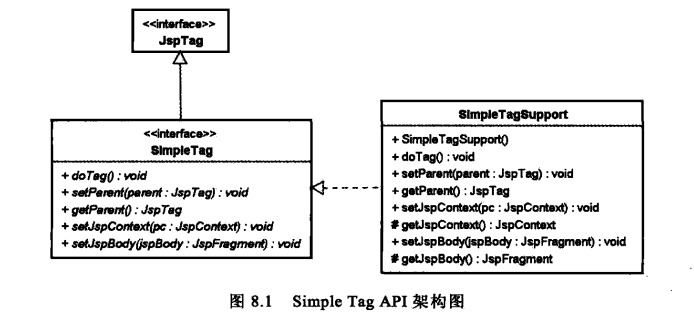

# 自定义标签

可以通过扩展 `javax.servlet.jsp.tagext` 包的成员，来自定义标签。

自定义标签的实现称为标签处理器（Tag Hander）。

* 简单的标签处理器是指，实现了 `SimpleTag` 接口的标签处理器，或继承自 `SimpleTagSupport` 类的标签处理器。
* 典型的标签处理器是指，实现了 `Tag`、`IterationTag` 或 `BodyTag` 接口的标签处理器，或继承自 `TagSupport` 或 `BodyTagSupport` 类的标签处理器。

简单的标签处理器和典型的标签处理器两者的比较：

* 简单的标签处理器更加容易编写，其生命周期也更为简单，但是它不应该包含一些耗资源的操作。因为每一次请求都会创建新的标签处理器实例，请求完成后就销毁实例。
* 简单的标签处理器不会由 JSP 容器进行缓存，但是这并不意味着简单的标签处理器就比典型的标签处理器更慢。

## 标签文件

标签文件从两个方面简化了编写标签的过程：

* 只用 JSP 就可以编写标签文件，不意味着不懂 Java 的人也可以编写标签扩展。
* 不需要标签库描述符（TLD）。标签库描述符中的 `tag` 元素描述了要在 JSP 中引用的标签的名称。使用标签文件时，标签的名称就是标签文件的名称，因此不需要标签库描述符了。

标签文件看起来就像一个 JSP。在标签文件中可以使用指令（除 page 指令外）、脚本元素，可以使用 EL，也可以使用 JSTL 和自定义标签。

JSP 容器可以选择将标签文件编译成 Java 标签处理器或者解读标签文件。例如，Tomcat 将标签文件转换为实现 `SimpleTag` 接口的简单标签处理器。

在标签文件中可以访问一系列隐式对象，这些隐式对象与 JSP 隐式对象类似：

隐式对象 | 说明
------- | ---
request | `javax.servlet.http.HttpServletRequest`
response | `javax.servlet.http.HttpServletResponse`
out | `javax.servlet.jsp.JspWriter`，其内部关联一个 `PrintWriter` 对象
session | `javax.servlet.http.HttpSession`
application | `javax.servlet.ServletContext`
config | `javax.servlet.ServletConfig`
jspContext | `javax.servlet.jsp.JspContext`

标签文件的扩展名为 tag 或 tagx。可以包含一个标签文件，被包含的的标签文件的扩展名为 tagf。

标签文件必须放在 WEB-INF/tags 目录及其子目录下。

## 简单的标签处理器

简单的标签处理器是指，实现了 `SimpleTag` 接口的标签处理器，或继承自 `SimpleTagSupport` 类的标签处理器。

`SimpleTag` 接口的主要接口方法只有一个：`doTag()`，并且在标签调用时只执行一次。业务逻辑、迭代及主体操作代码都在这里编写。主体是用一个 `JspFragment` 类表示的。

简单标签处理器的生命周期：

1. JSP 容器通过调用其无参构造器，创建一个标签处理器的实例。
2. JSP 容器调用其 `setJspContext()`，同时传入一个 `JspContext` 对象。
3. 如果表示标签处理器的标签嵌套在另一个标签中，JSP 容器就会调用其 `setParent()`，并传入外层标签处理器的实例。
4. JSP 容器会为标签处理器的每一个属性都调用 setter 方法。
5. 如果标签中有主体内容，JSP 将调用其 `setJspBody()`，将主体内容作为 `JspFragment` 传递。
6. JSP 容器调用其 `doTag()` 方法。所有变量在 `doTag()` 返回时进行同步。
7. JSP 容器销毁标签处理器的实例。

开发简单标签处理器的步骤：

1. 编写标签处理器。

	可以继承 `SimpleTagSupport` 类，并覆盖感兴趣的方法啊（通常就是 `doTag(）`）。

2. 定义标签库描述文件（TLD，Tag Library Descriptor）来注册标签。

	可以将 TLD 文件 放在 WEB-INF 目录及其子目录下，这样容器就会自动加载它。如果要用 JAR 文件来封装自定义标签处理器和 TLD 文件，则应该将 TLD 文件放在 JAR 文件的 META-INF 目录及其子目录中。

3. 在 JSP 上使用 taglib 指令。

SimpleTag 适合用于创建比较简单的标签，并且不包含一些耗资源的操作。因为每一次请求都会创建新的标签处理器实例，请求完成后就销毁实例。

### SimpleTag API



* JspTag 标志接口。所有的自定义标签都必须实现 `JspTag` 接口。

* SimpleTag 继承了 `JspTag` 接口，定义了 Simple Tag 处理器的接口。开发 Simple Tag 处理器时必须实现 `SimpleTag` 接口。

* SimpleTagSupport 实现了 `SimpleTag` 接口，并对所有方法提供了默认实现。开发简单标签处理器时，通常会继承 `SimpleTagSupport` 类，并覆盖感兴趣的方法（通常就是 `doTag(）`）。

当 JSP 容器调用 `SimpleTag` 接口的 `setJspContext()` 时，`SimpleTagSupport` 的 `getJspContext()` 将返回 JSP 容器传递的 `JspContext` 实例。

`JspContext` 最重要的方法是 `getOut()`，它返回一个 `JspWriter`，用于将响应发送到客户端。

通过 JSP 传来的 `JSPFragment` 可以管理标签主体。`JSPFragment` 表示一段 JSP 代码，可以不调用，也可以调用多次。JSP 片段的定义中不能包含 Scriptlet 或 Scriptlet 表达式，它只能包含模板文本和 JSP 动作。`JSPFragment` 类有两个方法：

* public abstract void invoke( Writer out ) throws JspException, IOException

	执行片段（标签主体），并将所有输出内容导到指定的 Writer。如果传给方法的参数为 null，那么输出的结果将会被导到与该片段相关的 `JspContext` 的 `getOut()` 所返回的 `JspWriter`。

* public abstract JspContext getJspContext()

	返回与这个 `JspFragment` 相关的 `JspContext`。

## TLD 文件

可以将 TLD 文件 放在 WEB-INF 目录及其子目录下，这样容器就会自动加载它。如果要用 JAR 文件来封装自定义标签处理器和 TLD 文件，则应该将 TLD 文件放在 JAR 文件的 META-INF 目录及其子目录中。

```xml
<tag>
	<!-- 标签的名称 -->
	<name>if</name>
	<!-- 标签处理器类 -->
	<tag-class>com.gmail.tequlia2pop.gossip.tag.IfTag</tag-class>
	<!-- 主体内容的类型：
		（1）scriptless 表示标签主体中不允许使用脚本元素
		（2）empty 表示没有主体内容
		（3）tagdependent 表示将主体中的内容当作纯文本处理
	-->
	<body-content>scriptless|empty|tagdependent</body-content>
	<!-- 标签的属性 -->
	<attribute>
		<!-- 属性的名称 -->
		<name>test</name>
		<!-- 属性是否必需 -->
		<required>true</required>
		<!-- 属性是否接受运行时运算的结果 -->
		<rtexprvalue>true</rtexprvalue>
		<!-- 属性的类型 -->
		<type>boolean</type>
	</attribute>
</tag>
```

## 典型的标签处理器

P320

在绝大多数情况下，使用 Simple Tag 应该能满足自定义标签的需求。但是，如果在 JSP 2.0 之前实现自定义标签，则是通过 Tag 接口下的相关类来完成。

典型的标签处理器是指，实现了 `Tag`、`IterationTag` 或 `BodyTag` 接口的标签处理器，或继承自 `TagSupport` 或 `BodyTagSupport` 类的标签处理器。

## 发布自定义标签

可以将自定义标签和 TLD 文件打包成一个 JAR 文件，以便提供给其他人使用。

在这种情况下，需要在 TLD 的 `uri` 元素中指定一个绝对的 URL。另外，应该将 TLD 文件放在 JAR 文件的 META-INF 目录及其子目录中。

