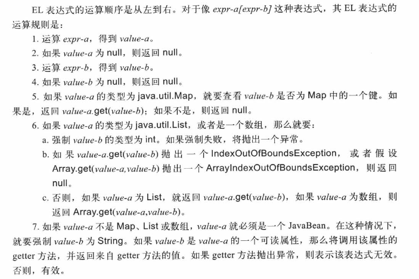

# 表达式语言（EL）

受 ECMAScript 和 XPath 表达式语言的启发，EL 被设计成能够轻松地编写无脚本或不包含 Java 代码的 JSP，即不使用 JSP 声明、表达式和 Scriptlet 的 JSP。

EL 的语法格式为：

```
${expression}
```

表达式从左到右进行运算，结果的类型强制为 String。如果 EL 用在某个定制标签的属性值中，那么将会运算这个表达式，并强制结果字符串为该属性想要的类型。

## EL 运算符

可以使用 `[]` 或 `.` 运算符来访问对象的属性：

```
${object["propertyName"]}
${object.propertyName}
```

如果 *propertyName* 不是有效的 Java 变量名称，则只能使用 `[]` 运算符。

例如，下面的表达式是相等的：

```
${pageContext["request"]["servletPath"]}
${pageContext.request["servletPath"]}
${pageContext.request.servletPath}
${pageContext["request"].servletPath}
```

除了 `[]` 或 `.` 运算符外，EL 还提供了 算数运算符、关系运算符、逻辑运算符、条件运算符及 `empty` 运算符。由于 EL 的目的是便于设计无脚本的 JSP，因此除条件运算符外，其他运算符的使用都十分有限。

算数运算符 | 语法
-------- | ----
加法 | +
减法 | -
乘法 | *
除法 | / 和 div
余数/模 | % 和 mod 

算数运算符优先级从高到低排列为：

* `*` `/` `div` `%` `mod`
* `+` `-`

关系运算符 | 语法
-------- | ----
等于 | == 和 eq
不等于 | != 和 ne
大于 | > 和 gt
大于或等于 | >= 和 ge
小于 | < 和 lt
小于或等于 | <= 和 le

逻辑运算符 | 语法
-------- | ----
AND | && 和 and
OR | || 和 or
NOT | ! 和 not

条件运算符的语法如下：

```
${statement ? A : B}
```

如果 statement 运算结果为 true，则这个表达式的结果就是 A，否则为 B。

empty 运算符的语法如下：

```
${empty X}
```
empty 运算符用来检验一个值是否为 null 或者为空。如果 X 为 null，或者 X 是一个长度为 0 的字符串，或者 X 是一个空的 Map、数组或者集合，那么该表达式将返回 true。

## EL 运算规则



## EL 隐式对象

隐式对象 | 描述
------ | ----
pageContext | 当前 JSP 的 `javax.servlet.jsp.PageContext`。可以通过它来访问其他的 JSP 隐式对象。因为经常需要访问请求参数，因此提供了 param 和 paramValues 两个隐式对象。
initParam | 包含所有 context 初始化参数的 Map，键为参数名称。
param | 包含所有请求参数的 Map，键为参数名称，值为参数值。如果有同名参数，则只会保留第一个参数的值。
paramValues | 包含所有请求参数的 Map，键为参数名称，值为参数值的字符串数组。例如，要获得 `selectedOptions` 参数的第一个和第二个值，可以使用 `${paramValues.selectedOptions[0]}`、`${paramValues.selectedOptions[1]}`。
header | 包含所有请求标头的 Map，键为标头名称，值为标头值。
headerValues | 包含所有请求标头的 Map，键为标头名称，值为标头值的字符串数组。
cookie | 包含当前请求对象中所有 Cookie 对象的 Map，键为 Cookie 的名称，值为 Cookie 对象。
applicationScope | 包含 ServletContext 对象中的所有属性的 Map，键为属性名称。
sessionScope | 包含 HttpSession 对象中所有属性的 Map，键为属性名称。
requestScope | ...
pageScope | ...

利用隐式对象 applicationScope、sessionScope、requestScope 和 pageScope 可以获得对应作用范围内的属性。如果一个 EL 表达式没有指定范围的话，JSP 容器将会按照范围从小到大的顺序从 pageScope、requestScope、sessionScope 和 applicationScope 中搜索指定的属性。

## 保留字

and eq gt true instanceof
or ne le false empty
not lt ge null div mod

## 自定义 EL 函数

编写 EL 函数的步骤：

* 编写一个 public 类，而想要调用的方法必须定义为 public、static 方法。
* 在 TLD 文件中来注册函数。

TLD 的 `function` 元素具有以下属性：

* description 特定于标签的可选信息。
* display-name XML 工具显示的简称。
* icon XML 工具可以使用的可选图标元素。
* name 函数的名称。
* function-class 实现该函数的 Java 类名。
* function-signature 表示该函数的 Java 方法签名。
* example 使用该函数的一个 example 的可选信息描述。
* function-extension 通过 XML 工具使用，没有扩展名，或者有多个扩展名，提供关于该函数的其他信息。

TLD 示例如下：

```xml
<function>
	<description>Collection Length</description>
	<name>length</name>
	<function-class>
	    cc.openhome.Util
	</function-class>
	<function-signature>
	    int length(java.util.Collection)
	</function-signature>
</function>
```

要使用函数，需要在 JSP 中利用 taglib 指令，使用 `uri` 属性指向 TLD，并指定一个前缀。然后使用以下语法调用函数：

```
${prefix:functionName(parameterList)}
```