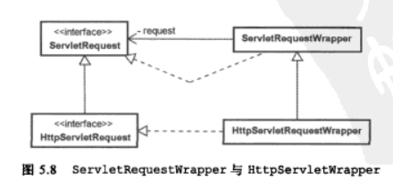

# Servlet API

## Servlet

**javax.servlet.Servlet** 接口定义了 Servlet 的生命周期方法：`init()`、`service()` 和 `destroy()`。所有的 Servlet 实例必须直接或间接地实现该接口才能在 Web 容器中运行。

该接口定义了初始化 servlet、服务请求和从服务器中删除 servlet 的方法。这些方法被称为生命周期方法，并按以下顺序调用：

* 构建 servlet，然后使用 `init` 方法进行初始化。
* 处理所有从客户端到 `service` 方法的调用。
* 取消 servlet 服务，然后使用 `destroy` 方法销毁 servlet，然后执行垃圾收集和 finalized。

**javax.servlet.ServletConfig** 是 Servlet 设置信息的代表对象，容器会为每个 Servlet 设置信息产生一个 Servlet 和 ServletConfig 实例。

* getInitParameter() 取得 Servlet 的初始化参数。
* getInitParameterNames() 取得 Servlet 的初始化参数。

**javax.servlet.GenericServlet** 定义一个通用的、与协议无关的 Servlet。它实现了 `Servlet` 和 `ServletConfig` 接口，它包含了两者所定义方法的简单实现，实现内容主要是通过 `ServletConfig` 来取得一些相关信息。所以在实现 Servlet 时，可以通过这些方法来取得所需的相关信息，而不用管 `ServletConfig` 的存在。

该类的 `service` 方法标记为 abstract。

## ServletContext

`javax.servlet.ServletContext`  代表了整个 Web 应用程序。当整个 Web 应用程序加载都 Web 容器后，容器会生成一个 `ServletContext` 对象作为整个应用程序的代表。

* getRequestDispatcher() 取得 `RequestDispatcher` 实例，然后可以进行请求的转发（forward）或包含（include）。实际上 `HttpServletRequest` 的 `getRequestDispatcher()` 最终都会委托个 `ServletContext` 的 `getRequestDispatcher()` 来执行。
* getResourcePaths() 返回 Web 应用程序的某个目录下的文件列表。
* getResourceAsStream() 可以使用该方法来读取 Web 应用程序中某个文件的内容。使用时指定路径必须以 "/" 作为开头，表示相对于应用程序环境根目录，或者相对于 `/WEB-INF/lib` 中 JAR 文件里的 `META-INF/resources` 的路径。

每个 Web 应用程序都会有一个对应的 `ServletContext`，针对应用程序初始化时需要的一些参数数据，可以在 web.xml 中使用 `<context-param>` 定义初始参数，结合 `ServletContextListener` 来完成。

## HTTPServlet

**javax.servlet.http.HttpServlet** 要创建适合于 Web 站点的 HTTP servlet，应该继承该抽象类。该类的 `service()` 方法通过判断 HTTP 请求的方式（GET、HEAD、POST、PUT、DELETE、OPTIONS、TRACE 等），再分别调用对应的 `doXXX()`。所以如果想针对 GET、POST 等请求进行处理，需要覆盖对应的 `doGet()`、`doPost()` 方法。

注意：这里使用了 Template Method 模式。所以不建议也不应该覆盖 `service()` 方法，这会覆盖掉 `HttpServlet` 中定义的预设处理流程。

## HttpServletRequest & HttpServletResponse

**HttpServletRequest** 表示 HTTP 请求。可以通过它获取 HTTP 请求的相关信息，包括请求参数、标头、上传文件等，还可以进一步设置包含（include）或转发（forward）。在进行请求包含或转发时，若有请求周期内必须共享的资源，则可以设置为请求范围属性。

* getParameter() 根据请求参数的名称获得对应的值。在获取请求参数时，要注意请求对象处理字符编码的问题，才可以正确处理非 ASCII 编码范围的字符。
* getParameterNames() 返回包括所有请求参数名称的 Enumeration。
* getParameterValues()  如果表单上有可复选的元件，如复选框（checkbox）、列表（List）等，则同一个请求参数名称会有多个值（查询字符串类似 `param=10&param=20&param=30`）。这时就可以使用 `getParameterValues()` 方法返回它们的字符串数组。 
* getParameterMap() 返回的 Map 对象的 key 是请求参数名称，value 部分是请求参数值（String[] 的形式，考虑到同一个请求参数有多个值的情况）。

* getHeader() 根据标头的名称获得对应的值。
* getHeaderNames() 返回包括所有标头名称的 Enumeration。
* getHeaders() 

* getPart() 取得 `multipartform-data` 请求的 `javax.servlet.http.Part` 组件。用于进行文件上传处理。

* getRequestDispatcher() 获取 `RequestDispatcher` 对象。`RequestDispatcher` 可以用于将请求转发（forward）到指定的资源，或者将指定的资源包含（include）到响应中。

* getAttribute() 取得指定名称的属性值。
* setAttribute() 设置指定名称的属性值。
* getAttributeNames() 取得所有属性的名称。
* removeAttribute() 移除指定名称的属性。

**HttpServletResponse** 表示 HTTP 响应。可以通过它设置响应类型、标头、缓冲区等，还可以进一步设置重定向、或发送错误状态信息，或者使用 `getWriter().println()` 或 `getOutputStream()` 来输出内容。

* setContentType() 设置响应类型。

* setHeader() 设置响应标头。
* setIntHeader() 设置整数类型的响应标头。
* setDateHeader() 设置日期类型的响应标头。
* addHeader() 附加响应标头。
* addIntHeader() 附加整数类型的响应标头。
* addDateHeader() 附加日期类型的响应标头。

* getBufferSize()
* setBufferSize()
* isCommited() 查看响应是否已提交。
* reset() 重置所有响应信息（包括标头）。
* resetBuffer() 重置响应内容（不包括标头）
* flushBuffer() 清除缓冲区中已设置的响应信息。

* sendRedirect() 重定向。
* sendError() 传送错误状态信息。

## Listener

ServletRequest 监听器

* ServletRequestListener ServletRequest 的生命周期监听器。它定义了在 ServletRequest 创建和销毁时会触发的方法。

* ServletRequestAttributeListener ServletRequest 的属性改变监听器。它定义了在属性被设置、移除或替换时会触发的方法。

HttpSession 监听器

* HttpSessionListener HttpSession 生命周期监听器。它定义了在 HttpSession 创建和销毁时会触发的方法。

	通过该监听器可以实现查看在线用户信息列表，以及并发会话控制。

* HttpSessionAttributeListener HttpSession 属性改变监听器。它定义了在属性被设置、移除或替换时会触发的方法。

* HttpSessionBindingListener  HttpSession 对象绑定监听器。它定义了在对象被绑定和解绑时会触发的方法。

* HttpSessionActivationListener HttpSession 对象迁移监听器。在使用分布式环境时，应用程序的对象可能分散在多个 JVM 中。当 HttpSession 要从一个 JVM 迁移到另一个 JVM 时，必须对所有的属性对象进行序列化，在 HttpSession 迁移到另一个 JVM 后，必须对所有的属性对象进行反序列化。对于实现了 `HttpSessionActivationListener` 的属性对象,在进行序列化和反序列化时会触发对应的方法。

ServletContext 监听器

* ServletContextListener ServletContext 生命周期监听器。它定义了在 Web 应用程序初始化后或即将销毁前会触发的方法。

	有些应用程序的设置，必须在 Web 应用程序初始化时进行，例如 HttpSession Cookie 设置。除了在 web.xml 中定义外，还可以在 ServletContextListener 的 `contextInitialized()` 中定义。

* ServletContextAttributeListener ServletContext 属性变化监听器。它定义了在属性被设置、移除或替换时会触发的方法。

## Filter

### 请求封装器

### 响应封装器

	

