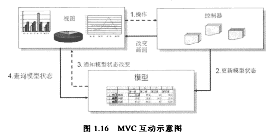
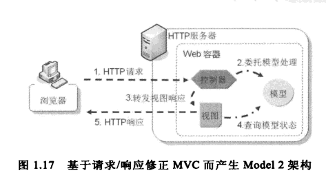
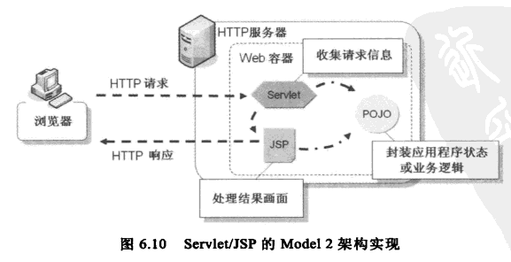
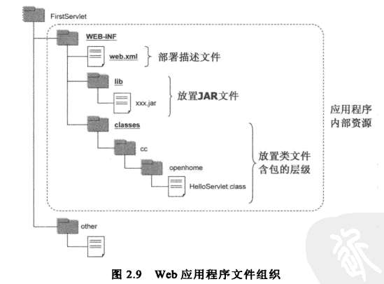
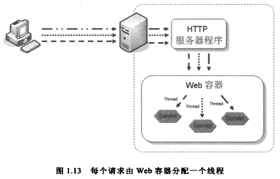
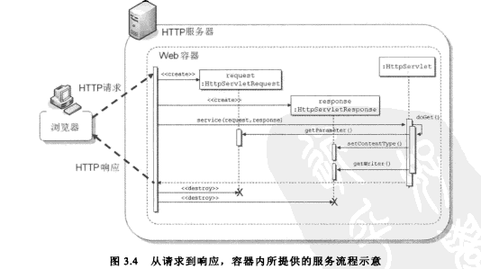

# Servlet 介绍

## MVC/Model 2

MVC（Model、View、Controller，模型、视图、控制器）

**应用于桌面应用程序的 MVC 模式**



**应用于 Web 应用程序的 MVC 模式**



桌面应用程序和 Web 应用程序的 MVC 模式有一个决定性的不同：由于 Web 应用程序是基于 HTTP 的请求/响应模型，没有请求就不会有响应，也就是 HTTP 服务器不可能主动对浏览器发出响应。

在 Model 2 架构下，控制器、模型、视图的职责如下：

* 控制器：取得和验证请求参数，委托模型处理，转发请求给视图。不应该出现 HTML 代码，不涉及业务逻辑。

* 模型：接受控制器的请求调用，负责处理业务逻辑和数据存取逻辑等。根据应用程序功能，产生多种不同职责的模型对象。不应该出现 HTML 代码。

* 视图：接受控制器的请求调用，从模型提取运算结果（模型通常将结果设置为各种作用域对象的属性），根据需求呈现所需的画面。不应该出现程序代码。

Model 2 架构的优点：

* 请求处理、业务逻辑和视图呈现被区分为三个不同的角色职责，方便了开发团队的分工合作。

许多 Web 框架都实现了 Model 2。

**Servlet/JSP 的 Model 2 模式**



## Web 目录结构



Web 目录结构必须符合一定的规范：

* **WEB-INF** 客户端无法直接访问 WEB-INF 中的内容。如果要访问其中的内容，必须通过 Servlet/JSP 的请求转发（Forward）。

* **WEB-INF/web.xml** Web 应用程序的部署描述文件。

* **WEB-INF/classes** 放置 .class 文件的目录。

* **WEB-INF/lib** 放置 JAR 文件的目录。

	* JAR 中可以放置 Servlet/JSP、自定义类、工具类、部署描述文件等，应用程序的的类加载器可以从 JAR 中载入对应的资源。
	* 如果要使用某个类，Web 应用程序会首先去 `WEB-INF/classes` 中试着加载类；若无，再试着从 `WEB-INF/lib` 的 JAR 文件中寻找类文件；如果还没有找到， 则会到容器实现本身存放类或 JAR 的目录中寻找。
	* 可以在 JAR 文件的 `/META-INF/resources` 目录中放置静态资源或 JSP 等。例如如果在 `/META-INF/resources` 中放入 `index.html`，若请求的 URL 中包括 `/openhome/index.html`，但实际上 `/openhome` 根目录下不存在 `index.html`，则会使用 JAR 文件中的 `/META-INF/resources/index.html`。 

如果 Web 应用程序的 URL 最后是以 "/" 结尾，

* 如果不存在该目录，则会使用预设的 Servlet。

* 如果存在该目录，则 Web 容器必须传回该目录下的欢迎页面。可以在 web.xml 中包括以下的定义，指出可用的欢迎页面。

	```xml
	<welcome-file-list>
		<welcome-file>index.html</welcome-file>
		<welcome-file>default.jsp</welcome-file>
	</welcome-file-list>
	```

	如果找不到以上的文件，则会尝试从 JAR 文件的 `META-INF/resources` 中寻找对应的资源页面。

## 使用 web-fragment.xml

P54

## Web 容器

Web 容器负责持有 Servlet 实例，还负责 Servlet 的生命周期和相关服务的连接。

* 在具体层面上，Web 容器就是一个 Java 程序。
* 在抽象层面上，可以将 Web 容器视为运行 Servlet/JSP 的 HTTP 服务器。

请求/响应的基本流程：

1. 客户端（大部分情况下是浏览器）对 Web 服务器发出 HTTP 请求。
1. HTTP 服务器接收到 HTTP 请求，将请求转由 Web 容器处理。Web 容器会剖析 HTTP 请求内容，创建各种对象，如代表请求的 `HttpServletRequest` 对象、代表响应的 `HttpServletResponse` 对象、`HttpSession` 对象等。
1. Web 容器根据 `@WebServlet` 注解或 web.xml 设置，决定使用哪个 Servlet 来处理请求，然后调用它的 `service()` 方法，`service()` 方法根据 HTTP 请求的方式掉哟哦那个对应的 `doXXX()` 方法。
1. 在 `doXXX()` 方法中，使用请求对象（`HttpServletRequest`）来获得请求相关的信息，使用响应对象（`HttpServletResponse`）来创建响应。
1. Web 容器将响应转换为 HTTP 响应，再由 HTTP 服务器对客户端进行响应。
1. 最后，Web 容器将 `HttpServletRequest`、`HttpServletResponse` 对象销毁回收，该次请求响应结束。



Web 服务器会为每个请求分配一个线程。注意，Web 容器可能会使用同一个 Servlet 实例来服务多个请求。也就是说，在多个请求下，就相当于多个线程在共同存取一个对象，因此得注意线程安全问题。



## Servlet

### Servelt 的生命周期

`javax.servlet.Servlet` 接口定义了 Servlet 的生命周期方法：初始化 Servlet、服务请求和销毁 Servlet 的 `init()`、`service()` 和 `destroy()` 方法。所有的 Servlet 实例必须直接或间接地实现该接口才能在 Web 容器中运行。

1. 容器负责加载和实例化 Servlet，并将 Servlet 设置信息封装为一个 `ServletConfig` 对象。

	默认情况下，Web 容器会在首次请求某个 Servlet 时才将它实例化并执行初始化。如果希望应用程序启动时，就将 Servlet 类载入、实例化和初始化，可以使用 `loadOnStartup` 设置。

1. 初始化 Servlet，通过调用 `init()` 来实现。

	如果想要控制 Servlet 初始化的流程，需要重新定义无参数的 `init()` 方法。

1. 服务请求，通过调用 `service()` 来实现。

1. 销毁 Servlet，通过调用 `destroy()` 方法来实现，通常用于指定进行 Servlet 销毁前的收尾工作。

### ServletConfig 和 ServletContext

`ServletConfig` 是 Servlet 设置信息的代表对象，容器会为每个 Servlet 设置信息产生一个 Servlet 和 ServletConfig 实例。通过该对象可以获得 `ServletContext`，Servlet 初始参数等。

`ServletContext`  代表了整个 Web 应用程序。当整个 Web 应用程序加载都 Web 容器后，容器会生成一个 `ServletContext` 对象作为整个应用程序的代表。通过该对象可以取得 ServletContext 初始参数，以及设置、取得和移除 ServletContext 属性。

### 实现 Servlet

Servlet 必须继承 `HttpServlet` 类。

不应该直接在 Servlet 中直接产生视图内容（如直接编写 HTML）。

`HttpServletRequest` 表示 HTTP 请求。可以通过它获取 HTTP 请求的相关信息，包括请求参数、标头、上传文件等，还可以进一步设置包含（include）或转发（forward）。在进行请求包含或转发时，若有请求周期内必须共享的资源，则可以设置为请求范围属性。

注意：在取得请求参数的时候，要注意请求对象处理字符编码的问题。

`HttpServletResponse` 表示 HTTP 响应。可以通过它设置响应类型、标头、缓冲区等，还可以进一步设置重定向、或发送错误状态信息，或者使用 `getWriter().println()` 或 `getOutputStream()` 来输出内容。

注意：为了让浏览器知道如何处理响应的内容，记得设置正确的内容类型（Content Type）。

## 监听器（Listener）

监听器可以监听某些事件的发生，然后进行一些想做的事情。

* 如果想在 `ServletRequest`、`HttpSession` 和 `ServletContext` 对象的创建、销毁时收到通知，则可以实现以下对应的监听器：

	* ServletRequestListener
	* HttpSessionListener 通过该监听器可以实现查看在线用户信息列表，以及并发会话控制。所谓并发控制，就是指限制单个用户登录到应用程序的能力。有些网站为了防止用户重复登录，会在数据库中以某个字段代表用户是否登录，分别在用户登录后和注释后对该字段进行设置。
	* ServletContextListener 通过该监听器可以实现必须在 Web 应用程序初始化进行的设置，例如 HttpSession Cookie 设置。

* 如果想在 `ServletRequest`、`HttpSession` 和 `ServletContext` 对象被设置、移除和替换属性时收到通知，则可以实现以下对应的监听器：

	* ServletRequestAttributeListener
	* HttpSessionAttributeListener
	* ServletContextAttributeListener

* 在某个对象成为 HttpSession 属性时，如果想要在该对象在绑定、解绑和迁移时收到通知，则可以在该对象上实现以下对应的监听器：

	* HttpSessionBindingListener
	* HttpSessionActivationListener

监听器中的接口方法会传入一个对应的 XXXEvent 对象，它封装了对应的目标对象。例如 `ServletContextListener` 的接口方法传入的 `ServletContextEvent` 对象封装了一个 `ServletContext` 对象。

## 过滤器（Filter）

可以根据需求替换过滤器或调整过滤器的顺序，也可以针对不同的 URL 应用不同的过滤器，设置在不同的 Servlet 间请求转发或包含时应用过滤器。

`FilterConfig` 类似于 Servlet 的 `ServletConfig` 接口，它是过滤器设置信息的代表对象。通过该对象可以获得 Filter 初始参数等。

常见的过滤器的应用场景：

* 性能评测

	例如实现一个简单的性能评测过滤器，可用来记录请求与响应的时间差，了解 Servlet 处理请求到响应所需花费的时间。

* 用户认证

	要保证某些操作只能由认证用户执行，可以通过过滤器来实现。例如，针对这些操作的 Servlet 或 URL，应用一个过滤器。在该过滤器中，根据 HttpSession 中有无特定的属性来判断用户是否认证通过；若已认证，则调用 `doFilter()`，否则重定向到登录页面。

* 编码设置

	使用请求封装器，在 `getParameter()` 中对请求参数进行字符编码。然后使用该请求封装器搭配过滤器，以进行字符编码的服务。

* 字符替换
	
	使用请求封装器，在 `getParameter()` 中对请求参数进行字符替换。然后使用该请求封装器搭配过滤器，以进行字符过滤的服务。

	实际上不建议使用过滤器对请求参数进行字符替换，可以使用 JSTL 的 `<c:out>` 标签在输出时替换字符。

* 响应压缩

	使用响应封装器，分别在 `getOutputStream()` 和 `getWriter()` 中返回一个支持压缩的 `ServletOutputStream` 和 `PrintWriter` 对象。然后使用该请求封装器搭配过滤器，以进行响应压缩的服务。

### 过滤器的生命周期

* init()
* doFilter() 
* destroy()

`FilterConfig` 是 Filter 设置信息的代表对象，它类似 Servlet 的 `ServletConfig` 对象。

### 实现过滤器

Filter 必须实现 `Filter` 接口。

如果一个 Servlet 可以应用某过滤器，那么在调用 Servlet 的 `service()` 方法前会先调用该过滤器的 `doFilter()` 方法。可以在 `doFilter()` 方法中进行 `service()` 的前置处理，而后决定是否调用 `FilterChain` 的 `doFilter()`。会运行下一个过滤器；如果没有下一个过滤器了，就调用请求目标 Servlet 的 `service()` 方法。

当请求来到过滤器时，会调用 Filter 接口的 `doFilter()` 方法，这个方法上有一个 `FilterChain` 参数。如果调用了 `FilterChain` 的 `doFilter()` 方法，就会运行下一个过滤器，如果没有过滤器了就会调用请求目标 Servlet 的 `service()` 方法。如果因为某个条件（例如用户认证不通过）而没有调用 `FilterChain` 的 `doFilter()` 方法，则请求不会继续到目标 Servlet。这就是所谓的**拦截请求**。

`FilterChain` 的 `doFilter()` 实现，概念上类似这样：

```java
Filter filter = filterIterator.next();
if(filter != null) {
	filter.doFilter(request, response, this);
} else {
	targetService.service(request, response);
}
```

在陆续调用完 Filter 实例的 `doFilter()` 仍至 Servlet 的 `service()` 之后，流程会以堆栈顺序返回，所以在 `FilterChain` 的 `doFilter()` 运行完毕后，就可以针对 `service()` 方法做后续处理：

```java
// service() 前置处理
chain.doFilter(request, response);
// service() 后置处理
```

在实现 `Filter` 接口时，不用理会这个 Filter 前后是否有其他的 Filter，完全作为一个独立的元件进行设计。

提示：Servlet 过滤器机制，其实是 JavaEE 的 Interceptor Filter 模式，其设计目标是弹性地替换某功能的前置和后置处理元件。

### 封装器

* `HttpServletRequestWrapper` 请求封装器。

	对于容器产生的 `HttpServletRequest` 对象，无法直接修改某些属性，如请求参数值。`HttpServletRequestWrapper` 实现了 `HttpServletRequest` 接口，只要继承它并编写重新定义的方法即可。

* `HttpServletResponseWrapper` 响应封装器

	类似请求封装器。