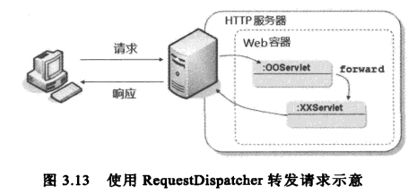
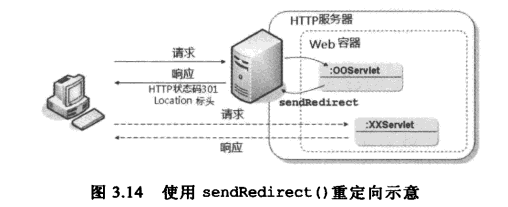

# Servlet 要点

## 配置 Servlet

使用 `@WebServlet` 可以声明一个 Servlet。Servlet 还必须继承 `HttpServlet` 类。

```java
@WebServlet("/hello")
public class HelloServlet extends HttpServlet {
	...
}
```

```java
@WebServlet(urlPatterns = { "/hello" }, loadOnStartup=1, 
	initParams = {
		@WebInitParam(name = "param1", value = "value1"),
		@WebInitParam(name = "param2", value = "value2") 
	}
)
public class HelloServlet extends HttpServlet {
	...
}
```

在 `@WebServlet` 中可以对 Servlet 进行以下配置：

* 使用 `urlPatterns` 设置指定 URL 模式。

* 使用 `loadOnStartup` 设置指定 Servlet 的加载时机。

	默认情况下，Web 容器会在首次请求某个 Servlet 时才将它实例化并执行初始化。如果希望应用程序启动时，就将 Servlet 类载入、实例化和初始化，可以使用 `loadOnStartup` 设置。设置大于 0 的 值（默认值为 -1），表示启动应用程序后就要初始化 Servlet；数字代表了 Servlet 的初始顺序，容器会保证具有较小数字的 Servlet 优先初始化。

	如果有多个 Servlet 在设置 `loadOnStartup` 时使用了相同的数字值，则容器实现厂商可以自行决定要如何载入哪个 Servlet。

* 使用 `@WebInitParam` 设置 Servlet 初始参数。

	Servlet 初始参数通常作为常数设置。

可以在 web.xml 中编写等效的配置：

```xml
<?xml version="1.0" encoding="UTF-8"?>
<web-app version="3.0" xmlns="http://java.sun.com/xml/ns/javaee" 
	xmlns:xsi="http://www.w3.org/2001/XMLSchema-instance"
	xsi:schemaLocation="http://java.sun.com/xml/ns/javaee http://java.sun.com/xml/ns/javaee/web-app_3_0.xsd">
	<servlet>
		<servlet-name>HelloServlet</servlet-name>
		<servlet-class>cc.openhome.HelloServlet</servlet-class>
		<init-param>
			<param-name>param1</param-name>
			<param-value>value1</param-value>
		</init-param>
		<init-param>
			<param-name>param2</param-name>
			<param-value>value2</param-value>
		</init-param>
		<load-on-startup>1</load-on-startup>
	</servlet>
	<servlet-mapping>
		<servlet-name>HelloServlet</servlet-name>
		<url-pattern>/hello</url-pattern>
	</servlet-mapping>
</web-app>
```

如果有多个 Servlet 在设置 `<load-on-startup>` 时使用相同的数字值，则依其在 web.xml 中设置的顺序来初始化 Servlet。

web.xml 中的设置会覆盖掉 Servlet 中的注解设置。所以，可以使用注解来作默认值，而 web.xml 来作日后更改设置值之用，这样便避免了修改源代码、重新编译和部署的操作。

## 配置 Listener

使用 `@WebListener` 可以声明一个监听器。监听器类还必须实现一个或多个特定 XXXListener 接口（如 `ServletContextListener`）。

```java
@WebListener
public class ContextParameterReader implements ServletContextListener {
	
 	@Override
	public void contextInitialized(ServletContextEvent sce) {
		...
	}

	@Override
	public void contextDestroyed(ServletContextEvent sce) {
		...
	}
}
```

可以在 web.xml 中编写等效的配置：

```xml
<listener>
	<listener-class>cc.openhome.ContextParameterReader</listener-class>
</listener>
```

## 配置 Filter

过滤器的设置与 Servlet 的设置很类似。

可以使用 `@WebFilter` 注解声明一个 filter。过滤器还必须实现 `Filter` 接口。

```java
@WebFilter(filterName = "someFilter", urlPatterns = { "/*" }, 
	initParams = {
		@WebInitParam(name = "param1", value = "value1"),
		@WebInitParam(name = "param2", value = "value2") 
	},
	dispatcherTypes = {
		DispatcherType.FORWARD, DispatcherType.INCLUDE, DispatcherType.REQUEST,
		DispatcherType.ERROR,
		DispatcherType.ASYNC }
)
public class SomeFilter implements Filter {
	...
}
```

在 `@WebFilter` 中可以对过滤器进行以下配置：

* 使用 `urlPatterns` 设置指定 URL 模式，即哪些 URL 请求必须应用该过滤器。

* 使用 `servletNames` 设置指定哪些 Servlet 必须应用该过滤器。

* 使用 `@WebInitParam` 设置指定过滤器的初始参数。

* 使用 `dispatcherTypes` 设置指定触发过滤器的时机。默认值为 `DispatcherType.REQUEST`，可选值包括：

	* DispatcherType.FORWARD 通过 `RequestDispatcher#forward()` 而来的请求
	* DispatcherType.INCLUDE 通过 `RequestDispatcher#include()` 而来的请求
	* DispatcherType.REQUEST 浏览器直接发出的请求
	* DispatcherType.ERROR 由容器处理例外而转发过来的请求
	* DispatcherType.ASYNC 异步处理的请求

可以在 web.xml 中编写等效的配置：

```xml
<filter>
	<filter-name>someFilter</filter-name>
	<filter-class>cc.openhome.SomeFilter</filter-class>
	<init-param>
		<param-name>param1</param-name>
		<param-value>value1</param-value>
	</init-param>
	<init-param>
		<param-name>param2</param-name>
		<param-value>value2</param-value>
	</init-param>
</filter>
<filter-mapping>
	<filter-name>someFilter</filter-name>
	<url-patterns>/*</url-patterns>
	<!-- <servlet-names>SomeServlet</servlet-names> -->

	<dispatcher>REQUEST</dispatcher>
	<dispatcher>FORWARD</dispatcher>
	<dispatcher>INCLUDE</dispatcher>
	<dispatcher>ERROR</dispatcher>
	<dispatcher>ASYNC</dispatcher>
</filter-mapping>
```

如果过滤器同时具有 `<url-pattern>` 和 `<servlet-name>` 设置，则先比对 `<url-pattern>`，在比对 `<servlet-name>`。如果某个 URL 或 Servlet 会应用多个过滤器，则根据 `<filter-mapping>` 在 web.xml 中出现的先后顺序，来决定过滤器的执行顺序。

## URL 模式设置

P51

请求 URI（requestURI）指的是 HTTP 请求第一行中从 协议名称到查询字符串中间的部分。可以使用 `HttpServletRequest` 的 `getRequestURI()` 返回该请求的请求 URI。一个请求 URI 实际上是由三个部分组成：

```
requestURI = contextPath + servletPath + pathInfo
```

* 上下文路径（contextPath） 容器根据上下文路径来决定挑选哪个 Web 应用程序（一个容器上可能部署多个 Web 应用程序）。可以使用 `HttpServletRequest` 的 `getContextPath()` 返回该请求的上下文路径。

* Servlet 路径（servletPath）即请求 URL 中用于调用 servlet 的部分，不包括路径信息（pathInfo）和查询字符串。Servlet 路径直接对应至 URL 模式信息。可以使用 `HttpServletRequest` 的 `getServletPath()` 返回该请求的 Servlet 路径。

* 路径信息（pathInfo） 指的四不包括上下文路径和 Servlet 路径部分的额外信息，并且不包括请求参数。可以使用 `HttpServletRequest` 的 `getPathInfo()` 返回该请求的路径信息。

## 读取 body 内容

* `HttpServletRequest#getReader()` 返回的 `BufferdReader` 可以读取请求的 body 的字节数据。
* `HttpServletRequest#getInputStream()` 返回的 `ServletInputStream` 可以读取请求的 body 的字符数据。

提交表单时，`<form>` 标签的默认值为 `application/x-www-form-urlencoded`。如果要上传文件，需要将 设置 `enctype="multipart/form-data"`。

如果要通过 `HttpServletRequest#getInputStream()` 来取得上传的文件，基本方式就是判断文件的开始与结束区段。

## 文件上传

在 Servlet 3.0 中，使用了 `@MultipartConfig` 注解标记的 Servlet 可以调用 `getPart()` 或 `getParts()` 方法协助处理文件上传。

`@MultipartConfig` 注解用于设置 Servlet 处理上传文件的相关信息。它具有下列属性：

* location 文件存储的目录位置。默认为空字符串。
* maxFileSize 限制上传文件的大小。默认值为 -1，表示不限制。
* maxRequestSize 限制 `multipart/form-data` 请求的数量。默认值为 -1，表示不限制。
* fileSizeThreshold 若上传文件大小超过设置值，会先写入缓存文件。默认值为 0。

`multipart/form-data` 发送的每个内容区段，都会有以下的标头信息：

```
Content-Disposition: form-data; name="filename"; filename="caterpillar.jpg"
Content-Type: image/jpeg
```

可以使用 `Part.getHeader("Content-Disposition")` 方法取得 `Content-Disposition` 标头的信息，然后取得 `filename` 属性的值，最后调用 `Part#write("filename")` 方法将上传文件写入磁盘。要写入的路径由 `@MultipartConfig` 注解指定。

与 `@MultipartConfig` 注解等效的 XML 配置：

```xml
<servlet>
	<servlet-name>UploadServlet</servlet-name>
	<servlet-class>cc.openhome.UploadServlet</servlet-class>
	<multipart-config>
		<location>c:/workspace</location>
	</multipart-config>
</servlet>
```

## 包含（include）和转发（forward）

使用 `HttpServletRequest` 的 `RequestDispatcher` 对象，可以把另一个 Servlet 的请求处理流程包含（include）进来，或者将请求转发（forward）给其他的 Servlet 处理。在包含和转发时，可以包括请求参数（字符串值）；如果有要共享的对象，则应该设置为请求对象的属性。

还可以使用 `ServletContext` 的 `getRequestDispatcher()` 或 `getNamedDispatcher()` 取得 `RequestDispatcher`。 

`RequestDispatcher` 定义了两个方法：

**include()**

必须为 `include()` 传入实现了 `ServletRequest`、`ServletResponse` 接口的对象，可以是 `service()` 传入的对象，或者是自定义的对象或封装器。 

注意：使用 `include()` 时，被包含的 Servlet 中任何对请求标头的设置都会被忽略。

在包含的 Servlet 中，可以使用下列请求范围属性取得上一个 Servlet 的信息：

* javax.servlet.include.request_uri 表示上一个 Servlet 的 Request URI
* javax.servlet.include.context_path 表示上一个 Servlet 的 Context path
* javax.servlet.include.servlet_path 表示上一个 Servlet 的 Servlet path
* javax.servlet.include.path_info 表示上一个 Servlet 的 Path info
* javax.servlet.include.query_string 表示上一个 Servlet 的取得 `RequestDispatcher` 时给定的请求参数

**forward()**

`forward()` 会将请求转发（forward）给其他的 Servlet 处理，包括对客户端的响应同时也转发给另一个 Servlet。

注意：`forward()` 方法必须在响应提交给客户端之前调用。在 `forward()` 方法调用之后，原先在响应缓冲区中没有提交的内容将被自动清除。

在被转发请求的 Servlet 中，可以使用下列请求范围属性取得上一个 Servlet 的信息：

* javax.servlet.forward.request_uri 表示上一个 Servlet 的 Request URI
* javax.servlet.forward.context_path 表示上一个 Servlet 的 Context path
* javax.servlet.forward.servlet_path 表示上一个 Servlet 的 Servlet path
* javax.servlet.forward.path_info 表示上一个 Servlet 的 Path info
* javax.servlet.forward.query_string 表示上一个 Servlet 的取得 `RequestDispatcher` 时给定的请求参数

两者的区别在于：使用 `include()` 方法将请求转发给其他的 Servlet，被调用的 Servlet 对该请求做出的响应将并入原先的响应对象中，原先的 Servlet 可以继续输出响应信息。而使用 `forward()` 将请求转发给其他的 Servlet，将由被调用的 Servlet 负责对请求做出响应，而原先的 Servlet 的执行则终止。

## 设置响应对象的缓冲区

容器可以（但非必要）对响应进行缓冲，通常容器都会对响应进行缓冲。可以操作缓冲的方法如下：

* getBufferSize()
* setBufferSize()
* isCommited() 查看响应是否已提交。
* reset() 重置所有响应信息（包括标头）。
* resetBuffer() 重置响应内容（不包括标头）
* flushBuffer() 清除缓冲区中已设置的响应信息。

在缓冲区未满之前，设置的响应相关内容都不会真正传至客户端。可以使用 `isCommited()` 查看响应是否已提交。

`HttpServletResponse` 对象若被容器关闭，则必须清除所有的响应内容。响应对象被关闭的时间点有以下：

* Servlet 的 `service()` 方法已结束，响应的内容长度超过 `HttpServletResponse` 的 `setContentLength()` 所设置的长度。
* 调用了 `sendRedirect()` 方法。
* 调用了 `sendError()` 方法。
* 调用了 `AsyncContext` 的 `complete()`。

## 为响应对象设置内容类型（Content Type）

因为客户端需要知道如何处理响应，所以必须为响应设置内容类型。`setContentType()` 用于设置 content-type 响应标头，只需指定 MIME（Multipurpose Internet Mail Extensions） 类型即可。由于编码设置和内容类型都需要设置，所以通常会调用 `setContentType()` 方法时同时指定内容类型和 charset 属性。

```java
@Override
protected void doPost(HttpServletRequest request, HttpServletResponse response)
		throws ServletException, IOException {
	...

	response.setContentType("application/pdf");
	InputStream in = this.getServletContext().getResourceAsStream("/WEB-INF/jdbc.pdf");
	OutputStream out = response.getOutputStream();
	writeBytes(in, out);// Java IO 操作

	...
}
```

常见的 MIME 类型：

* text/html
* application/pdf
* application/jar
* application/x-zip
* image/jpeg

可以使用 `ServletContext#getMimeType()` 来取得某个文件的 MIME 类型名称。

可以在 web.xml 中设置对应 MIME 类型的后缀名称：

```xml
<mime-mapping>
	<extension>pdf</extension>
	<mime-type>application/pdf</mime-type>
</mime-mapping>
```

## 重定向



请求转发处于同一个请求周期，所以请求对象属性可以在转发过程总共享，而且地址栏上的 URL 不会发生变化。



请求重定向要求浏览器重新请求另一个 URL。`response.sendRedirect()` 方法会在响应中设置 HTTP 状态码 301 以及 Location 标头，浏览器接收到这个标头，会重新使用 GET 方法请求指定的 URL，因此地址栏上会发现 URL 的变更。

## 发送错误状态信息

可以使用 `HttpServletResponse#sendError()` 发送服务器默认的错误状态信息。

```java
response.sendError(HttpServletResponse.SC_NOT_FOUND);
```

## 作用域对象及其属性

* HttpServletRequest
* HttpSession
* ServletContext

在设置请求范围属性时，注意属性名称由 `java.` 或 `javax.` 开头的名称通常保留给某些特定意义的属性。

## Q&A

设置 Web 应用程序环境的根目录（Context Root）

设置方式因使用的 Web 应用程序服务器不同而有所不同。

* Tomcat

	默认使用应用程序目录作为环境根目录。在 Eclipse 中，可以在项目上右击，然后选择 Properties，在 Web Project Settings 中进行设置。