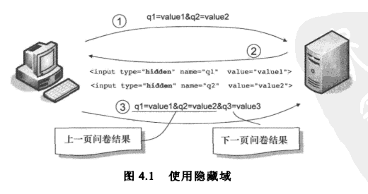
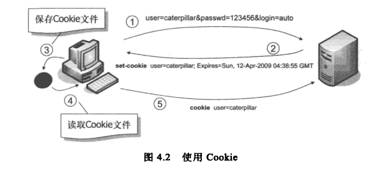
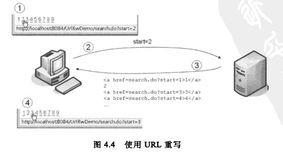
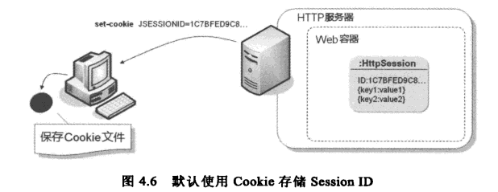
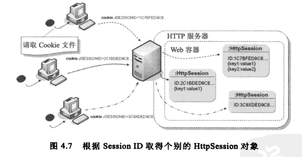

# 会话管理（Session Management）

Web 应用程序是基于 HTTP 协议的，而 HTTP 是一种基于请求/响应的无状态的通信协议。换句话说，服务器不会记得这次请求与下一次请求之间的关系。然而有些功能必须由多次请求来完成，例如购物车，用户可能在多个购物网页之间采购商品。

会话管理（Session Management）或会话跟踪（Session Tracking）是一种在客户端和服务器之间保持状态的解决方案。简单地说，当一个客户在多个页面间切换时，服务器会保存该用户的信息。

既然服务器不会记得两次请求间的关系，可以由浏览器在每次请求时“主动告知”服务器多次请求间必要的信息，服务器只要简单地处理请求中的相关信息即可。相关的方式包括隐藏表单字段（Hidden Form Field）、Cookie、RL 重写（URL Rewriting）等。

实现会话管理有以下四种方式：

*   使用隐藏表单字段（Hidden Form Field）

	利用 HTML 中的 hidden 属性，把客户端的信息以隐藏表单字段的方式发送给服务器。如下所示：

		<input type="hidden" name="userID" value="15"> 

	使用隐藏表单字段的缺点在于关掉网页后会遗失先前请求的信息，而且在查看网页源代码时可以看到隐藏字段的值。

*   使用 Cookie

	Cookie 的缺点：

	* 如果用户关闭了 Cookie 的话，便无法利用 Cookie 来达到会话跟踪的功能。
	* 保存在 Cookie 中的数据可以被访问，甚至被修改。
	* 浏览器对 Cookie 的大小和数量会有一定的限制。
	* 使用 Cookie 来传递信息时，随着 Cookie 数量和访问量的增加，它占用的网络带宽会很大。


*   URL 重写（URL Rewriting）

	URL 重写（URL Rewriting）其实就是 GET 请求参数的应用。当服务器响应客户端的请求时，通过在 GET 方法的 URL 尾部添加一些额外的请求参数，服务器将这个标识符与它所存储的有关会话的数据关联起来。

	使用 URL 重写的优点是 Cookie 被禁用或者根本不支持的情况下依旧能够工作，但也有很多缺点：
	
	* URL 重写是 GET 请求参数的应用，而 GET 请求参数的长度有限。
	* 必须对所有指向网站的 URL 进行编码。
	* 所有页面必须动态生成。
	* 不能使用预先记录下来的 URL 或者从其他网站链接进行访问。

*   使用 HttpSession

	HttpSession 基于 Cookie 或 URL 重写技术，当客户端允许使用 Cookie 时，HttpSession 使用 Cookie 进行会话管理；否则会选择使用 URL 重写。

	要实现 URL 重写，应该在 servlet 返回的所有 URL 上调用 response 的 `encodeURL()` 方法。此方法仅当 cookie 被禁用时才会在 URL 中加入 session ID; 否则，它返回原始的 URL。

 	HttpSession 的弱点在于不容易在多台服务器之间共享。

## 使用隐藏表单字段（Hidden Form Field）

例如，一个网络问卷分为几个页面，上一页面作答完后，必须请求服务器显示下一个页面。可以将上一页的问卷答案设置为下一页的隐藏表单字段，这样在提交下一页表单时就可以一并发送这些隐藏字段，每一页的问卷答案就可以保留下来。



使用隐藏表单字段的缺点在于关掉网页后会遗失先前请求的信息，而且在查看网页源代码时可以看到隐藏字段的值。

隐藏字段不是 Servlet/JSP 实际管理会话时的机制。

## Cookie



Cookie 是浏览器存储信息的一种方式。服务器可以产生 Cookie 并将它作为 set-cookie 响应标头返回给浏览器。浏览器在收到包含 Cookie 的响应后，会把 Cookie 的内容以键值对（key/value）的形式写入到一个文本文件中。在客户端再次访问服务器时（在符合 Cookie 的限制条件的前提下），会将 Cookie 数据作为 cookie 请求标头发送给服务器。这样服务器就可以再次获得 Cookie 中存放的数据了。 

Cookie 是 Web 应用程序会话管理的基本方式。

Cookie 的缺点：

* 如果用户关闭了 Cookie 的话，便无法利用 Cookie 来达到会话跟踪的功能。
* 保存在 Cookie 中的数据可以被访问，甚至被修改。
* 浏览器对 Cookie 的大小和数量会有一定的限制。
* 使用 Cookie 来传递信息时，随着 Cookie 数量和访问量的增加，它占用的网络带宽会很大。

Cookie 的实际应用：

* 实现用户自动登录功能。
* 有些购物网站会使用 Cookie 来记录用户的浏览时间，在下次用户访问时，仍然可以根据 Cookie 中保存的浏览历史记录为用户建议购物清单。

Servlet 本身提供了创建、设置与读取 Cookie 的 API。

```java
Cookie cookie = new Cookie("user", "caterpillar");
cookie.setMaxAge(7 * 24 * 60 * 60);// 设置一星期内有效
response.addCookie(cookie);
```

```java
Cookie[] cookies = request.getCookies();// 获得 Cookie
if (cookies != null) {
	for (Cookie cookie : cookies) {
		String name = cookie.getName();
		String value = cookie.getValue();
		...
	}
}
```

## URL 重写（URL Rewriting）



URL 重写（URL Rewriting）其实就是 GET 请求参数的应用。当服务器响应客户端的请求时，通过在 GET 方法的 URL 尾部添加一些额外的请求参数，服务器将这个标识符与它所存储的有关会话的数据关联起来。如下所示：

```
http://host/path/file.html;jsessionid=1234
```

使用 URL 重写的优点是 Cookie 被禁用或者根本不支持的情况下依旧能够工作，但也有很多缺点：

* URL 重写是 GET 请求参数的应用，而 GET 请求参数的长度有限。
* 必须对所有指向网站的 URL 进行编码。
* 所有页面必须动态生成。
* 不能使用预先记录下来的 URL 或者从其他网站链接进行访问。

## HttpSession 会话管理

以上三种会话管理的方式，都必须自行处理对浏览器的响应，决定哪些信息必须送至浏览器，以便在之后的请求一并发送相关信息，供 Web 应用程序辨识请求间的关联。

HttpSession 隐含了“面向连接”和“保持状态”这样两个含义。“面向连接”指的是通信双方在通信之前要先建立一个通信的渠道，如打电话，知道对方接了电话通信才能开始。“保持状态”则是指通信的一方能够把一系列的消息关联起来，使得消息之间可以互相依赖。使用 HttpSession，开发人员完全可以从 Java 应用程序的角度触发来进行会话管理，而忽略 HTTP 无状态的事实。

HttpSession 默认使用带有 Session ID 的 Cookie 进行会话跟踪。当客户端禁用 Cookie 时，可以使用 URL 重写来发送 Session ID，此时可以使用 `HttpServletResponse` 的 `encodeURL()` 协助产生所需的 URL 重写。当容器尝试取得 HttpSession 实例时，如果能取得带有 Session ID 的 Cookie,`encodeURL()` 会返回原始的 URL；否则（通常是浏览器禁用 Cookie 的情况），`encodeURL()` 会自产生带有 Session ID 的 URL 重写。





* 使用 Cookie

	通过 Cookie 将 Session ID 存储在浏览器中（在 Tomcat 中，Cookie 的名称是 JSESSIONID）。当浏览器请求应用程序时，会将 Cookie 中存放的 Session ID 一并发送给应用程序，Web 容器会根据 Session ID 来找出对应的 HttpSession 对象。

	默认情况下，关闭浏览器时存储 Session ID 的 Cookie 会失效。所以重新启动浏览器请求应用程序时，通过 `getSession()` 取得的是新的 HttpSession 对象。要使 HttpSession 立即失效必须运行 `invalidate()` 方法，否则它只会等到设置的失效期间过后才会被容器销毁回收。

* 使用 URL 重写

	使用 `HttpServletRequest` 的 `encodeURL()` 协助产生所需的 URL 重写。当容器尝试取得 HttpSession 实例时，如果能取得带有 Session ID 的 Cookie,`encodeURL()` 会返回原始的 URL；否则（通常是浏览器禁用 Cookie 的情况），`encodeURL()` 会自产生带有 Session ID 的 URL 重写。

注意：小心保管 Session ID。在 HttpSession 存活期间，只要有人取得当次的 Session ID，在另一个浏览器相同的 URL 附上 Session ID，就可以取得同一个 HttpSession 对象。建议加密敏感信息，并在不使用 HttpSession 时执行 `invalidate()` 明确使之失效。会话阶段重要的操作，最好再做一次身份确认（例如在线转账前再输入一次密码）。

取得 `HttpSession` 对象：

```java
HttpSession session = request.getSession();
```

注意： `HttpSession` 并非线程安全，所以必须注意属性设置时共享存取的问题。

`HttpSession` 的主要方法：

* getAttribute()
* setAttribute()
* invalidate() 使目前的 HttpSession 失效。例如实现注销机制。
* setMaxInactiveInterval() 设置浏览器多久没有请求应用程序的话，HttpSession 就自动失效（单位为秒）。

可以在 web.xml 中设置 HttpSession 默认的失效时间（单位为分）：

```xml
<web-app>
	<session-config>
		<session-timeout>30</session-timeout>
	</session-config>
</web-app>
```

在 Servlet 3.0 中新增了 `SessionCookieConfig` 接口，可以通过 `ServletContext#getSessionCookieConfig()` 取得实现该接口的对象。通过 `SessionCookieConfig` 实现对象，可以设置存储 Session ID 的 Cookie 相关信息，例如Session ID 的名称、存储 Session ID 的 Cookie 存活期限（单位为秒）等。

注意，设置 `SessionCookieConfig` 必须在 `ServletContext` 初始化之前，所以实际上只能在 web.xml 中进行设置。或者是实现 `ServletContextListener`，容器在初始化 `ServletContext` 时会调用 `ServletContextListener` 的 `contextInitialized()` 方法，可以在其中取得 `ServletContext` 来设置 `SessionCookieConfig`。

```xml
<web-app>
	<session-config>
		<cookie-config>
			<name>sid-caterpillar</name>
			<http-only>true</http-only>
		</cookie-config>
	</session-config>
</web-app>
```